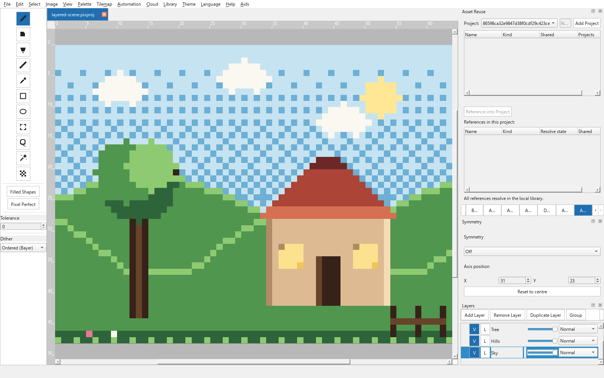
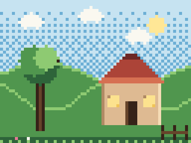
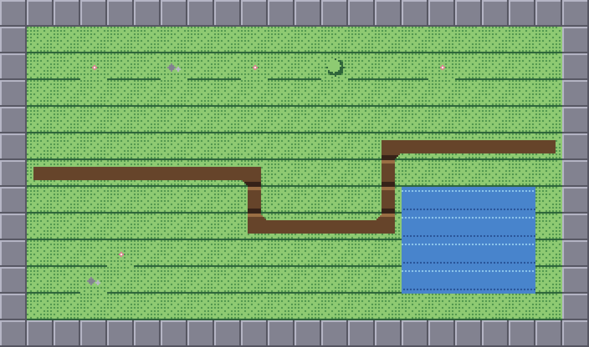
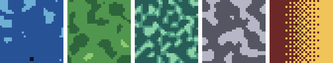
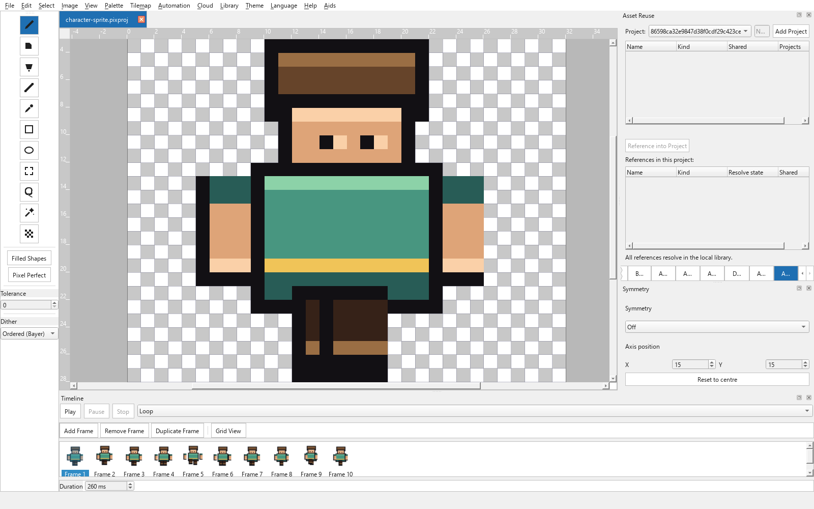
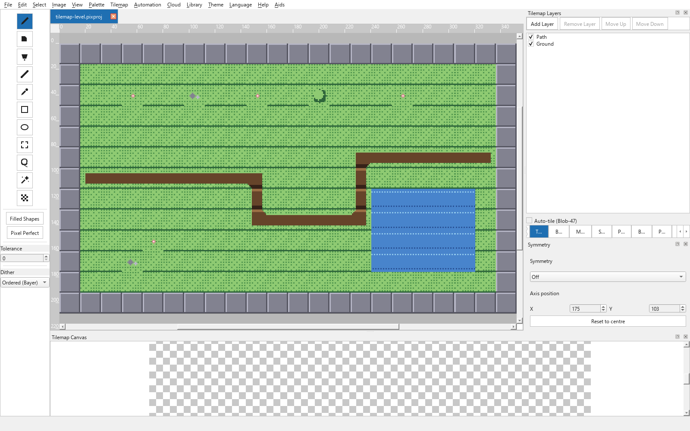
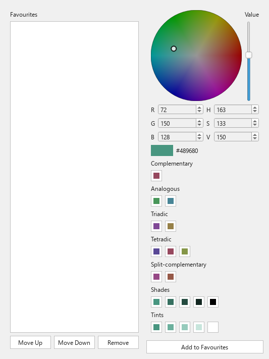
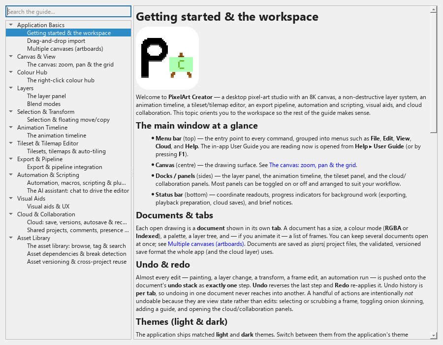

# PixelArt Creator

[](https://github.com/JuanGSanchez/PixelArt-Creator/actions/workflows/ci.yml)
[](https://github.com/JuanGSanchez/PixelArt-Creator/actions/workflows/docs-pages.yml)
[](https://github.com/JuanGSanchez/PixelArt-Creator/actions/workflows/build-installers.yml)
[](https://github.com/JuanGSanchez/PixelArt-Creator/blob/main/LICENSE)
[](https://github.com/JuanGSanchez/PixelArt-Creator/releases)
[](https://github.com/JuanGSanchez/PixelArt-Creator/releases)
[](https://github.com/JuanGSanchez/PixelArt-Creator/commits/main)


*[Read in English](README.md)*

**PixelArt Creator** es una plataforma multiplataforma de creación de arte pixel construida
sobre Python y PySide6 (Qt 6). Combina un lienzo editable de gran tamaño con capacidad para
8K con un modelo de capas no destructivo y un compositor rápido y acotado por región, y crece
hacia animación, mapas de tiles, un pipeline de exportación byte-reproducible, automatización
y scripting, ayudas visuales no destructivas, almacenamiento en la nube y colaboración, y una
capa de gestión de equipo y recursos a nivel de estudio — todo documentado desde dentro de la
aplicación mediante una Guía de usuario completa y sin conexión.

Su arquitectura es una división estricta en tres capas: `ui/` (PySide6), `logic/` (Python
puro, sin Qt) y `data/` (E/S, sin Qt). El comportamiento del dominio vive en las capas puras y
es totalmente comprobable sin interfaz gráfica; Qt queda confinado a la capa de UI.

<picture>
  <source media="(prefers-color-scheme: dark)" srcset="docs/images/screenshots/main-canvas-layers-dark.png">
  
</picture>

*Lienzo principal y panel de capas de PixelArt Creator (tema oscuro mostrado arriba en el
modo oscuro de GitHub; tema claro en la imagen de respaldo) — ver la
[Galería](#galería) más abajo para más ejemplos.*

## Características principales

La plataforma se ha construido por fases; las capacidades siguientes están **entregadas**.

- **Lienzo y dibujo** — una cuadrícula editable de gran tamaño con capacidad para 8K, con
  zoom, desplazamiento, una cuadrícula de píxeles con ajuste, renderizado de vecino más
  cercano, y pintura con clic izquierdo / menú contextual con clic derecho.
- **Color** — un centro de color contextual con clic derecho, con una lista de favoritos
  persistida, una rueda de color RGB, y armonías de teoría del color en vivo
  (complementaria, análoga, triádica, complementaria dividida, además de rampas de sombra/tinte).
- **Capas** — un sistema de capas no destructivo con grupos, opacidad, visibilidad, bloqueos,
  máscaras, capas de referencia e inteligentes, doce modos de fusión, y modos de color
  RGBA/indexado.
- **Selección y transformación** — selecciones de rectángulo / lazo / varita mágica y una
  vista previa flotante de mover/copiar con gestos de sumar/restar, confirmar y cancelar.
- **Animación** — una línea de tiempo de fotogramas con duración por fotograma, modos de
  reproducción (bucle / una vez / ping-pong / inversa), onion skinning, y etiquetas de
  fotograma con nombre.
- **Mapas de tiles y diseño de niveles** — divide una imagen en un tileset, pinta un mapa de
  tiles multicapa e infinito con estampar / borrar / rellenar, resuelve bordes con auto-tile
  Blob-47, e importa/exporta JSON compatible con Tiled.
- **Pipeline de exportación** — exporta como PNG, GIF animado, hoja de sprites o atlas de
  texturas empaquetado con metadatos JSON de estilo Aseprite y perfiles de motor Unity / Godot;
  exportación por lotes; y un exportador de línea de comandos sin interfaz gráfica. La salida
  es byte-reproducible para una entrada fija.
- **Automatización y scripting** — graba y reproduce macros deterministas, ejecuta un DSL de
  comandos aislado y basado en datos (sin `eval`/`exec`), amplía la aplicación con
  complementos de confianza y consentimiento explícito, recolorea por lotes muchos objetivos
  a la vez, genera contenido de forma procedural, y ejecuta cualquier automatización sin
  interfaz gráfica desde la línea de comandos.
- **Ayudas visuales** — una vista previa en vivo a tamaño real, guías y reglas con ajuste,
  cuadrículas isométricas y de perspectiva, un tablero de referencia de estilo PureRef, varias
  vistas sincronizadas de un mismo documento, y grabación reproducible de timelapse — todo no
  destructivo.
- **Nube y colaboración** — guarda/abre proyectos mediante una interfaz de nube agnóstica de
  proveedor con historial de versiones completo, guardado automático y recuperación ante
  fallos; comparte un proyecto con un listado de miembros (propietario / editor / espectador),
  comentarios encadenados y presencia; co-edición en tiempo real con cursores en vivo; y
  ramificado de arte al estilo git con fusión libre de conflictos.
- **Gestión de equipo y recursos** — cataloga sprites, animaciones, tilesets, mapas de tiles y
  paletas como recursos con nombre, etiquetados y buscables, almacenados una sola vez por
  contenido (deduplicados); un grafo de dependencias consultable con un indicador pasivo de
  roturas; un historial de versiones por recurso de solo adición; reutilización por referencia
  (no por copia) entre proyectos; exportación/importación de los recursos referenciados de un
  proyecto; y respaldo opcional en la nube de los blobs compartidos.
- **Asistente de IA** — un panel de chat integrado y **agnóstico de modelo** que maneja el
  editor en lenguaje natural sobre la misma capa de automatización segura y libre de `eval`.
  Tú aportas cualquier proveedor compatible con **OpenAI** o **Anthropic** (URL base, modelo y
  clave); es **opcional respecto a credenciales** y tu clave se guarda en el **llavero (keyring)
  del sistema operativo**, nunca en el archivo del proyecto. Las acciones están clasificadas
  por niveles de seguridad — las ediciones reversibles se aplican automáticamente y siguen
  siendo deshacibles, mientras que las acciones destructivas piden confirmación primero.
- **Guía de usuario integrada** — una guía completa, sin conexión y con búsqueda que cubre
  cada área funcional, abierta desde **Ayuda ▸ Guía de usuario** o **F1**.

## Galería

<table>
<tr>
<td width="50%"><br><sub>Animación del personaje — ciclo de caminar de 8 fotogramas</sub></td>
<td width="50%"><br><sub>Escena por capas — 5 capas no destructivas</sub></td>
</tr>
<tr>
<td><br><sub>Mapa de baldosas — auto-baldosado Blob-47</sub></td>
<td><br><sub>Generación procedural y automatización</sub></td>
</tr>
<tr>
<td><br><sub>Línea de tiempo de animación</sub></td>
<td><br><sub>Editor de mapas de baldosas</sub></td>
</tr>
<tr>
<td><br><sub>Centro de Color</sub></td>
<td><br><sub>Guía de usuario integrada</sub></td>
</tr>
</table>

Cada imagen de ejemplo anterior se creó con la propia PixelArt Creator, y puede regenerarse
a partir del estado del producto versionado con
[`scripts/showcase/`](scripts/showcase/README.md).

## Despliegue / instalación / lanzamiento

### Requisitos

- **Python 3.13 o más reciente** (`requires-python = ">=3.13"`) — ese es el mínimo de
  instalación. El propio proyecto se desarrolla y se prueba contra un intérprete fijado
  de forma exacta, **3.13.13** (`.python-version`), que es lo que ejecutan CI y la imagen
  de despliegue; cualquier 3.13.x más reciente (o posterior) satisface el mínimo para
  ejecutar la aplicación.
- Las dependencias en tiempo de ejecución están declaradas en `pyproject.toml` y se instalan
  automáticamente: PySide6 (Qt 6), NumPy, Pillow, y las bibliotecas de colaboración `pycrdt` y
  `websockets`.

### Instalación

Instala desde un checkout de código fuente con pip:

```sh
pip install .
```

El nombre del paquete distribuido es **`pixelart-creator`**.

Un extra opcional habilita el acceso en vivo a credenciales de proveedores de nube:

```sh
pip install ".[cloud_live]"
```

El extra `cloud_live` añade soporte de llavero del sistema operativo (`keyring`) usado por
los adaptadores de proveedor reales de Google Drive / OneDrive / Dropbox. **No** es necesario
para el uso sin conexión, para las rutas de colaboración en memoria/loopback, ni para el resto
de la plataforma — conecta un proveedor real solo si pretendes usar almacenamiento en la nube
en vivo.

Quienes desarrollan pueden instalar el conjunto de herramientas de pruebas/lint con el extra
`dev`:

```sh
pip install ".[dev]"
```

### Puntos de entrada de línea de comandos

Instalar el paquete proporciona tres comandos de consola (declarados en `pyproject.toml` bajo
`[project.scripts]`):

- **`pixelart-export`** — el pipeline de exportación sin interfaz gráfica (PNG / GIF / hoja de
  sprites / atlas, metadatos y perfiles de motor, exportación por lotes).
- **`pixelart-run`** — el ejecutor de automatización sin interfaz gráfica (macros y scripts
  DSL), produciendo resultados idénticos a ejecutar la misma automatización en la interfaz
  gráfica.
- **`pixelart-assistant`** — el asistente de IA sin interfaz gráfica: ejecuta el mismo
  asistente agnóstico de modelo que el panel integrado, sobre un proyecto de forma no
  interactiva, p. ej.
  `pixelart-assistant --input in.pixproj --output out.pixproj --prompt "..."`
  (`--provider` / `--base-url` / `--model` seleccionan el proveedor; la clave de API se lee del
  **llavero del sistema operativo**, nunca se pasa por línea de comandos). Usa la misma
  seguridad por niveles — las ediciones reversibles se aplican automáticamente, mientras que
  **las acciones destructivas se rechazan a menos que optes por ellas con
  `--approve-destructive` (alias `--yes`)**.

Ejecuta cualquiera con `--help` para ver sus opciones:

```sh
pixelart-export --help
pixelart-run --help
pixelart-assistant --help
```

### Lanzar la aplicación de escritorio

Lanza el editor de escritorio con cualquiera de los dos comandos canónicos:

```sh
# Desde un checkout de código fuente o cualquier entorno con el paquete instalado
python -m pixelart_creator

# Tras `pip install .` — el comando de lanzamiento de la GUI instalada
pixelart-creator
```

Ambos inician la misma aplicación: la ventana Qt `Main_Window`
(`pixelart_creator.ui.main_window`), levantada por el lanzador en
`pixelart_creator.ui.app` (que obtiene o crea la `QApplication`, aplica el tema y los
alternativos de fuente, y luego ejecuta el bucle de eventos de Qt). `python -m
pixelart_creator` es el punto de entrada del módulo; `pixelart-creator` es el comando de
consola de GUI instalado (declarado en `pyproject.toml` bajo `[project.gui-scripts]`),
disponible tras `pip install .`.

La aplicación se ejecuta en Windows, Linux y macOS allí donde PySide6 (Qt 6) y Python 3.13+
estén disponibles.

### Instaladores nativos

Para quienes no tienen un entorno Python, PixelArt Creator también se distribuye como
**instaladores nativos** construidos por la matriz de build de CI (activada en una ejecución
de build/tag) y descargables desde los artefactos de build:

- **Windows** — un instalador `.exe` con los plugins de Qt necesarios incluidos; instálalo y
  lánzalo como cualquier aplicación de escritorio.
- **Linux** — un **AppImage** autocontenido e independiente de la distribución; hazlo
  ejecutable (`chmod +x`) y ejecútalo directamente, sin necesidad de Python del sistema ni
  paquete de la distro.
- **macOS** — una `.app` envuelta en un `.dmg`. La build actual está **sin firmar**, así que en
  el primer lanzamiento Gatekeeper de macOS la bloquea: **clic derecho en la app ▸ Abrir** y
  confirma, o quita el indicador de cuarentena con
  `xattr -dr com.apple.quarantine "/ruta/a/PixelArt Creator.app"`. La firma con Developer-ID y
  la notarización son un paso planificado y sujeto a credenciales, y no son necesarios para
  ejecutar la aplicación.

### Alojar el backend de sincronización en tiempo real

La colaboración en tiempo real funciona lista para usar **sin configuración de alojamiento**
— el backend de sincronización se ejecuta localmente en la interfaz loopback por defecto.
Alojarlo en otro sitio es **opcional**, y **no hay una opción forzada por defecto**: el relé
puede ejecutarse **localmente/loopback** (la opción por defecto), a través del **adaptador de
proveedor de nube**, o **autoalojado en un VPS**. Adoptar cualquier opción **no requiere
ningún cambio** en la app ni en el código del backend.

Para el autoalojamiento en VPS, el directorio `deploy/` versionado incluye los artefactos para
ejecutar el relé `sync_backend/` (sin cambios) en tu propio servidor, cada uno con
instrucciones de configuración incluidas:

- **`deploy/Dockerfile`** — una imagen de contenedor ligera y libre de Qt
  (`docker build -f deploy/Dockerfile`; ejecutar con `--ulimit nofile=65535:65535 -p
  8765:8765`).
- **`deploy/pixelart-sync.service`** — una unidad systemd (`LimitNOFILE=65535`).
- **`deploy/nginx-sync.conf`** — un proxy inverso de Nginx que termina TLS y hace proxy de
  WSS → WS (con tiempos de espera compatibles con WebSocket).

El lanzador `deploy/run_sync_backend.py` se enlaza mediante `PIXELART_SYNC_HOST` (por defecto
`0.0.0.0`) y `PIXELART_SYNC_PORT` (por defecto `8765`). Consulta la guía de despliegue para la
receta completa, las notas sobre el límite de conexiones, y la ejecución de aceptación
demostrable en localhost.

### Visor web complementario

Un proyecto compartido también puede abrirse en un **navegador** — en un teléfono o un
escritorio — a través de un **enlace de compartición firmado** y de corta duración. El visor es
**solo de visualización y con interacción ligera** (alternar capas, navegación de fotogramas,
desplazamiento/zoom); nunca edita el proyecto. Es un cliente HTML/CSS/JS puro (sin paso de
build, sin nueva dependencia) servido por la misma pila de backend de sincronización + Nginx:
el cliente se carga desde una ubicación estática `/viewer/` de Nginx y se conecta de vuelta a
través del relé WSS existente, presentando el token firmado. El token es de corta duración,
limitado a solo lectura, y se verifica sin almacenarse nunca, así que un enlace solo concede
una ventana de solo lectura a un proyecto.

El cliente vive en `web_viewer/` y el bloque de servicio de producción en
`deploy/nginx-sync.conf`. El formato de la conexión y el contrato del token firmado están
especificados en [ADR-0036](docs/adr/0036-web-viewer-wire-and-signed-token-contract.md); la
generación de enlaces de compartición y la postura de token/seguridad están implementadas en
`web_viewer/dev_server.py` (véanse las docstrings en línea y
`web_viewer/tests/test_share_token.py`), y la comprobación de fidelidad de píxel entre
navegadores vive en `web_viewer/tests/test_render_fidelity.py`. Actualmente no existe una
guía única y consolidada para operadores que reúna todo esto.

## Documentación

- **Guía de usuario integrada** — la documentación principal para el usuario, disponible sin
  conexión desde **Ayuda ▸ Guía de usuario** (o **F1**). Cubre cada área funcional con flujos
  de trabajo paso a paso y es buscable desde dentro de la aplicación.
- La misma Guía de usuario también está publicada en línea, en inglés y en español, en
  **https://juangsanchez.github.io/PixelArt-Creator/**.
- La documentación del proyecto (registro de cambios, páginas de uso y registros de diseño)
  se mantiene junto al código fuente y se mantiene al día conforme se entregan funcionalidades.

## Contribuir

Las contribuciones son bienvenidas. Consulta [CONTRIBUTING.md](CONTRIBUTING.md) para la
configuración y el flujo de desarrollo, [CODE_OF_CONDUCT.md](CODE_OF_CONDUCT.md) para las
normas de la comunidad, y [SECURITY.md](SECURITY.md) para reportar una vulnerabilidad de
forma privada.

## Licencia

PixelArt Creator se distribuye bajo la **Licencia Apache 2.0**. Consulta los archivos
[LICENSE](LICENSE) y [NOTICE](NOTICE) para conocer los términos completos.
